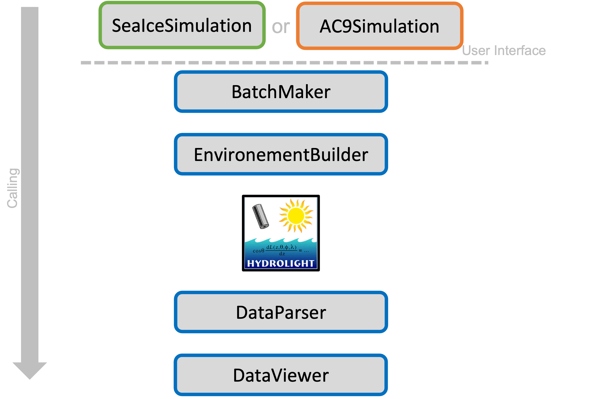

# HE60-PyMagister

PyMagister is a Python interface of Hydro Light MacOS version. 

## Instructions:

Open _run_me.py_ to run (Mobley et al. 1998) and user built geometry examples.

### What HE60-PyMagister can do:
1. Create arbitrary IOP (absorption(z), scattering(z), bb(z)) profiles as they would have been measured with an ac9 profile.
2. Create automatically batch files
3. Create and run a bash (.sh) file to execute Hydro Light

### Classes calling scheme used in HE60-PyMagister

For questions and comment please see Bastian Raulier (Takuvik, Université Laval) [contact](mailto:bastian.raulier.1@ulaval.ca). 
